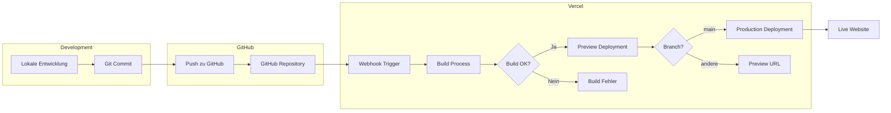
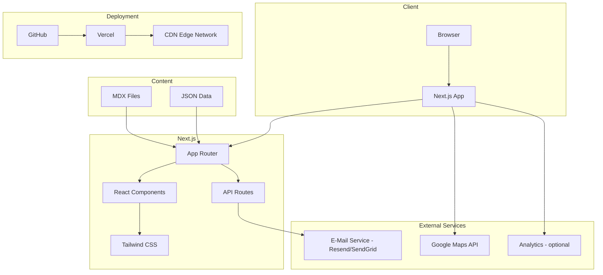

# Konzept: Sprachschul-Webseite

## Projektübersicht

Eine moderne, schlichte Business-Webseite für eine Sprachschule in der Schweiz, entwickelt mit Next.js, React und Tailwind CSS, deployed über GitHub auf Vercel.

---

## 1. Technologie-Stack

### Frontend
- **Framework**: Next.js 14+ (App Router)
- **UI-Library**: React 18+
- **Styling**: Tailwind CSS 3.4+
- **Animationen**: Framer Motion
- **Icons**: Lucide React
- **Formulare**: React Hook Form + Zod (Validierung)

### Content Management
- **Option A**: MDX für statische Inhalte (einfach, keine Datenbank)
- **Option B**: Headless CMS (Sanity, Contentful oder Strapi) für dynamische Inhalte

### Internationalisierung
- **next-intl** für Mehrsprachigkeit (DE/FR/IT/EN)

### Deployment
- **Hosting**: Vercel
- **Repository**: GitHub
- **CI/CD**: Automatisches Deployment bei Push auf main-Branch

---

## 2. Seitenstruktur und Navigation

```
/
├── / (Startseite)
├── /kurse (Kursübersicht)
│   └── /kurse/[slug] (Kursdetails)
├── /ueber-uns (Über die Schule)
│   └── /ueber-uns/team (Team-Vorstellung)
├── /preise (Preisliste)
├── /kontakt (Kontaktformular + Standort)
├── /blog (News/Blog - optional)
│   └── /blog/[slug] (Einzelner Artikel)
└── /impressum & /datenschutz (Rechtliches)
```

### Hauptnavigation
1. Startseite
2. Kurse
3. Über uns
4. Preise
5. Kontakt

### Footer-Navigation
- Impressum
- Datenschutz
- Social Media Links
- Sprachauswahl

---

## 3. Seitenbeschreibungen

### 3.1 Startseite (/)
- **Hero-Section**: Großes Bild/Video mit Headline und CTA
- **USP-Section**: 3-4 Vorteile der Schule (Icons + Text)
- **Kurs-Highlights**: 3 beliebteste Kurse als Karten
- **Testimonials**: Kundenbewertungen (Slider)
- **CTA-Section**: Aufforderung zur Kontaktaufnahme
- **Partner/Zertifikate**: Logos von Partnern oder Zertifizierungen

### 3.2 Kursübersicht (/kurse)
- **Filter**: Nach Sprache, Niveau, Format (Gruppe/Einzel/Online)
- **Kurskarten**: Bild, Titel, Kurzbeschreibung, Preis, CTA
- **Suchfunktion**: Optional

### 3.3 Kursdetails (/kurse/[slug])
- Ausführliche Beschreibung
- Kursinhalte (Akkordeon)
- Zielgruppe
- Dauer und Termine
- Preis
- Anmeldeformular oder CTA

### 3.4 Über uns (/ueber-uns)
- Geschichte der Schule
- Mission und Werte
- Methodik
- Team-Übersicht mit Link zu Detailseite

### 3.5 Team (/ueber-uns/team)
- Teamkarten mit Foto, Name, Rolle, Sprachen
- Optional: Detailseiten pro Person

### 3.6 Preise (/preise)
- Preistabellen nach Kurstyp
- Vergleichstabelle
- FAQ zu Preisen
- Hinweis auf Rabatte/Aktionen

### 3.7 Kontakt (/kontakt)
- Kontaktformular (Name, E-Mail, Telefon, Nachricht, Kursinteresse)
- Standort mit Karte (Google Maps oder OpenStreetMap)
- Öffnungszeiten
- Telefon und E-Mail
- Social Media Links

### 3.8 Blog (/blog) - Optional
- Artikelliste mit Vorschau
- Kategorien/Tags
- Suchfunktion

---

## 4. Design-System

### 4.1 Farbpalette (Beispiel - anpassbar)

```css
/* Primärfarben */
--primary-50: #f0f9ff;
--primary-100: #e0f2fe;
--primary-500: #0ea5e9;  /* Hauptfarbe */
--primary-600: #0284c7;
--primary-700: #0369a1;

/* Neutralfarben */
--gray-50: #f9fafb;
--gray-100: #f3f4f6;
--gray-500: #6b7280;
--gray-900: #111827;

/* Akzentfarben */
--accent: #f59e0b;  /* Für CTAs und Highlights */

/* Semantische Farben */
--success: #10b981;
--error: #ef4444;
```

### 4.2 Typografie

```css
/* Schriftarten */
--font-heading: 'Inter', sans-serif;  /* oder 'Poppins' */
--font-body: 'Inter', sans-serif;

/* Größen */
--text-xs: 0.75rem;
--text-sm: 0.875rem;
--text-base: 1rem;
--text-lg: 1.125rem;
--text-xl: 1.25rem;
--text-2xl: 1.5rem;
--text-3xl: 1.875rem;
--text-4xl: 2.25rem;
--text-5xl: 3rem;
```

### 4.3 Spacing und Layout

- **Container**: max-width 1280px, zentriert
- **Spacing-Scale**: 4px Basis (Tailwind Standard)
- **Section-Padding**: py-16 bis py-24
- **Grid**: 12-Spalten-System

### 4.4 Komponenten-Bibliothek

| Komponente | Beschreibung |
|------------|--------------|
| Button | Primary, Secondary, Outline, Ghost |
| Card | Kurs-Karte, Team-Karte, Testimonial-Karte |
| Input | Text, Email, Textarea, Select |
| Navigation | Desktop-Nav, Mobile-Nav (Hamburger) |
| Hero | Verschiedene Layouts |
| Section | Container mit Titel und Content |
| Footer | Multi-Column mit Links |
| Modal | Für Formulare oder Infos |
| Accordion | Für FAQ und Kursinhalte |
| Tabs | Für Kursfilter |
| Badge | Für Labels und Tags |
| Slider | Für Testimonials |

---

## 5. Projektstruktur

```
linguasud/
├── public/
│   ├── images/
│   │   ├── hero/
│   │   ├── team/
│   │   ├── courses/
│   │   └── logos/
│   ├── fonts/
│   └── favicon.ico
├── src/
│   ├── app/
│   │   ├── [locale]/
│   │   │   ├── layout.tsx
│   │   │   ├── page.tsx
│   │   │   ├── kurse/
│   │   │   │   ├── page.tsx
│   │   │   │   └── [slug]/
│   │   │   │       └── page.tsx
│   │   │   ├── ueber-uns/
│   │   │   │   ├── page.tsx
│   │   │   │   └── team/
│   │   │   │       └── page.tsx
│   │   │   ├── preise/
│   │   │   │   └── page.tsx
│   │   │   ├── kontakt/
│   │   │   │   └── page.tsx
│   │   │   ├── blog/
│   │   │   │   ├── page.tsx
│   │   │   │   └── [slug]/
│   │   │   │       └── page.tsx
│   │   │   ├── impressum/
│   │   │   │   └── page.tsx
│   │   │   └── datenschutz/
│   │   │       └── page.tsx
│   │   ├── api/
│   │   │   └── contact/
│   │   │       └── route.ts
│   │   ├── globals.css
│   │   └── layout.tsx
│   ├── components/
│   │   ├── ui/
│   │   │   ├── Button.tsx
│   │   │   ├── Card.tsx
│   │   │   ├── Input.tsx
│   │   │   └── ...
│   │   ├── layout/
│   │   │   ├── Header.tsx
│   │   │   ├── Footer.tsx
│   │   │   ├── Navigation.tsx
│   │   │   └── MobileMenu.tsx
│   │   ├── sections/
│   │   │   ├── Hero.tsx
│   │   │   ├── Features.tsx
│   │   │   ├── CourseHighlights.tsx
│   │   │   ├── Testimonials.tsx
│   │   │   └── CTA.tsx
│   │   └── forms/
│   │       └── ContactForm.tsx
│   ├── lib/
│   │   ├── utils.ts
│   │   └── validations.ts
│   ├── data/
│   │   ├── courses.ts
│   │   ├── team.ts
│   │   └── testimonials.ts
│   ├── hooks/
│   │   └── useMediaQuery.ts
│   ├── types/
│   │   └── index.ts
│   └── i18n/
│       ├── config.ts
│       └── messages/
│           ├── de.json
│           ├── fr.json
│           ├── it.json
│           └── en.json
├── .env.local
├── .env.example
├── .gitignore
├── next.config.js
├── tailwind.config.ts
├── tsconfig.json
├── package.json
└── README.md
```

---

## 6. Datenmodell

### 6.1 Kurs (Course)

```typescript
interface Course {
  id: string;
  slug: string;
  title: string;
  description: string;
  shortDescription: string;
  language: 'german' | 'french' | 'italian' | 'english' | 'spanish';
  level: 'A1' | 'A2' | 'B1' | 'B2' | 'C1' | 'C2' | 'all';
  format: 'group' | 'individual' | 'online' | 'hybrid';
  duration: string;
  schedule: string;
  price: number;
  priceUnit: 'per_lesson' | 'per_month' | 'total';
  image: string;
  features: string[];
  targetAudience: string;
  maxParticipants?: number;
  startDates?: string[];
  isPopular?: boolean;
}
```

### 6.2 Teammitglied (TeamMember)

```typescript
interface TeamMember {
  id: string;
  name: string;
  role: string;
  image: string;
  bio: string;
  languages: string[];
  qualifications?: string[];
  email?: string;
}
```

### 6.3 Testimonial

```typescript
interface Testimonial {
  id: string;
  name: string;
  role?: string;
  company?: string;
  image?: string;
  quote: string;
  course?: string;
  rating?: number;
}
```

### 6.4 Blog-Artikel (BlogPost)

```typescript
interface BlogPost {
  id: string;
  slug: string;
  title: string;
  excerpt: string;
  content: string;
  author: string;
  publishedAt: string;
  updatedAt?: string;
  image: string;
  tags: string[];
  category: string;
}
```

---

## 7. Deployment-Workflow



### Deployment-Schritte

1. **Repository erstellen**: GitHub Repository initialisieren
2. **Vercel verbinden**: GitHub Repository mit Vercel verknüpfen
3. **Environment Variables**: API-Keys und Secrets in Vercel konfigurieren
4. **Domain**: Custom Domain in Vercel einrichten
5. **Automatisches Deployment**: Bei jedem Push auf `main` wird automatisch deployed

---

## 8. Architektur-Übersicht



---

## 9. SEO und Performance

### SEO-Maßnahmen
- Semantisches HTML
- Meta-Tags pro Seite (Title, Description, OG-Tags)
- Strukturierte Daten (JSON-LD) für LocalBusiness
- Sitemap.xml automatisch generiert
- robots.txt
- Canonical URLs
- Mehrsprachige hreflang-Tags

### Performance-Optimierungen
- Next.js Image Optimization
- Lazy Loading für Bilder und Komponenten
- Static Site Generation (SSG) wo möglich
- Font Optimization mit next/font
- Minimales JavaScript-Bundle
- Caching-Strategien

---

## 10. Implementierungs-Phasen

### Phase 1: Grundgerüst
- [ ] Next.js Projekt initialisieren
- [ ] Tailwind CSS konfigurieren
- [ ] Basis-Layout (Header, Footer, Navigation)
- [ ] Routing-Struktur aufsetzen
- [ ] Design-System Grundlagen (Farben, Typografie)

### Phase 2: Kernseiten
- [ ] Startseite mit allen Sections
- [ ] Kursübersicht und Kursdetails
- [ ] Über uns und Team
- [ ] Preisseite
- [ ] Kontaktseite mit Formular

### Phase 3: Funktionalität
- [ ] Kontaktformular Backend (API Route)
- [ ] E-Mail-Versand Integration
- [ ] Google Maps Integration
- [ ] Responsive Design finalisieren

### Phase 4: Internationalisierung
- [ ] next-intl Setup
- [ ] Übersetzungsdateien erstellen
- [ ] Sprachauswahl-Komponente
- [ ] URL-Struktur für Sprachen

### Phase 5: Optimierung und Launch
- [ ] SEO-Optimierung
- [ ] Performance-Optimierung
- [ ] Accessibility-Check
- [ ] Testing
- [ ] Vercel Deployment
- [ ] Domain-Konfiguration

### Phase 6: Optional
- [ ] Blog-Funktionalität
- [ ] CMS-Integration
- [ ] Analytics-Setup
- [ ] Cookie-Banner

---

## 11. Offene Fragen für spätere Klärung

1. **Branding**: Logo, Farbschema, Schriftarten
2. **Content**: Texte, Bilder, Kursbeschreibungen
3. **Sprachen**: Welche Sprachen soll die Website unterstützen?
4. **Kurse**: Detaillierte Kursinformationen
5. **Team**: Anzahl und Informationen zu Teammitgliedern
6. **Kontakt**: E-Mail-Adresse für Formular-Empfang
7. **Domain**: Gewünschte Domain für die Website
8. **Rechtliches**: Impressum und Datenschutz-Texte
9. **Analytics**: Google Analytics oder Alternative?
10. **Budget für externe Services**: E-Mail-Service, Maps API, etc.

---

## 12. Technische Voraussetzungen

### Entwicklung
- Node.js 18+
- npm oder pnpm
- Git
- VS Code (empfohlen)

### Accounts
- GitHub Account
- Vercel Account (kostenlos für Hobby-Projekte)
- Optional: E-Mail-Service Account (Resend, SendGrid)

---

*Dieses Konzept dient als Grundlage und kann nach Bedarf angepasst werden.*
